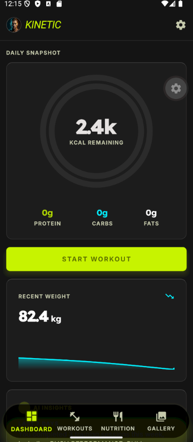
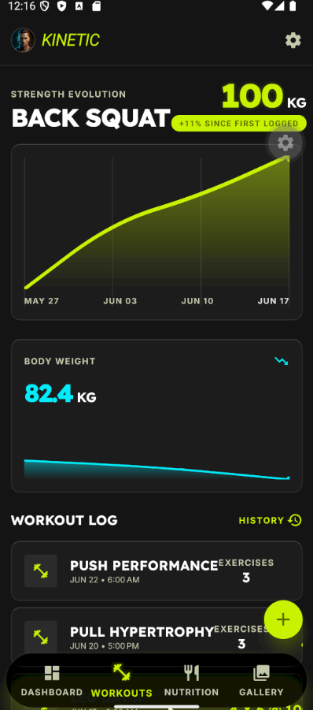
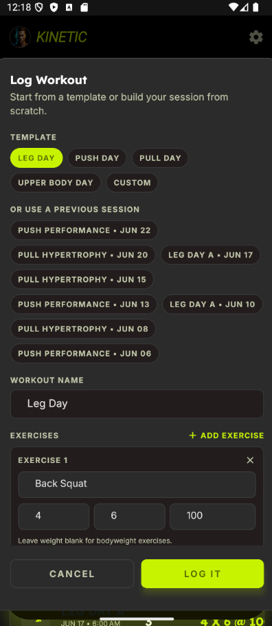
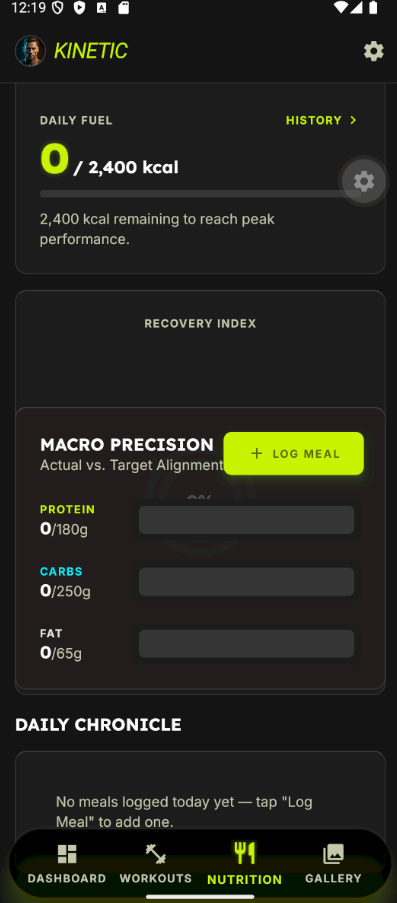
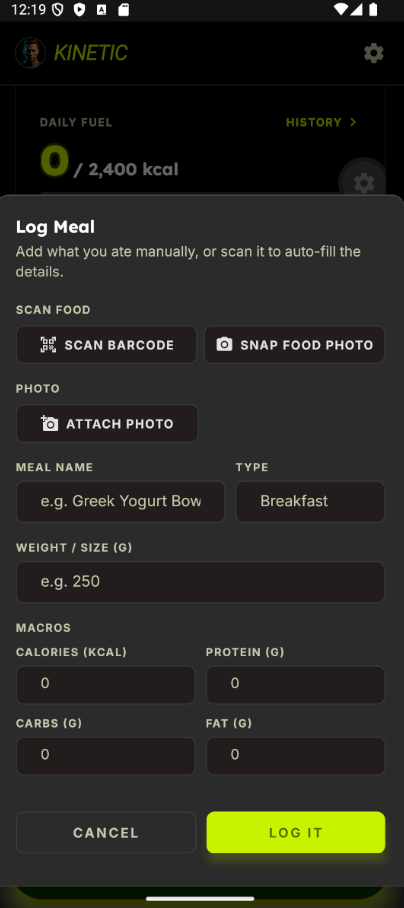
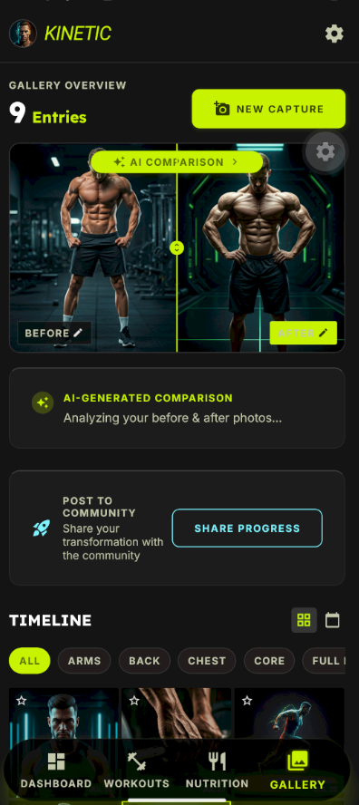
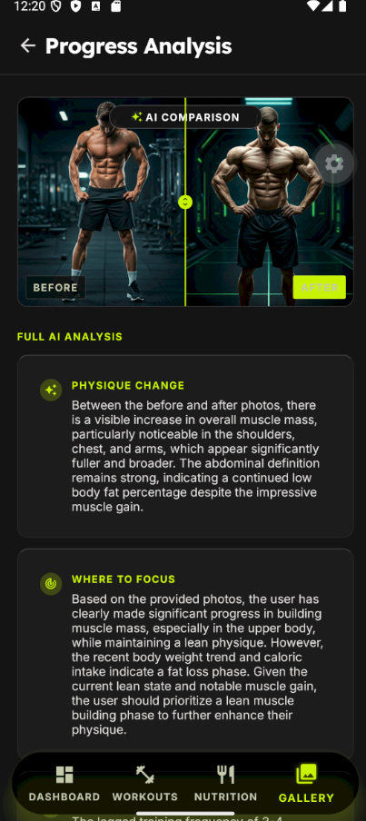
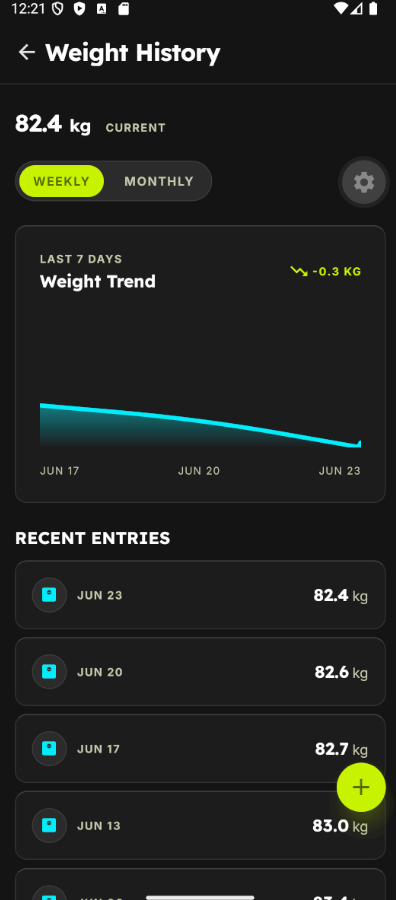
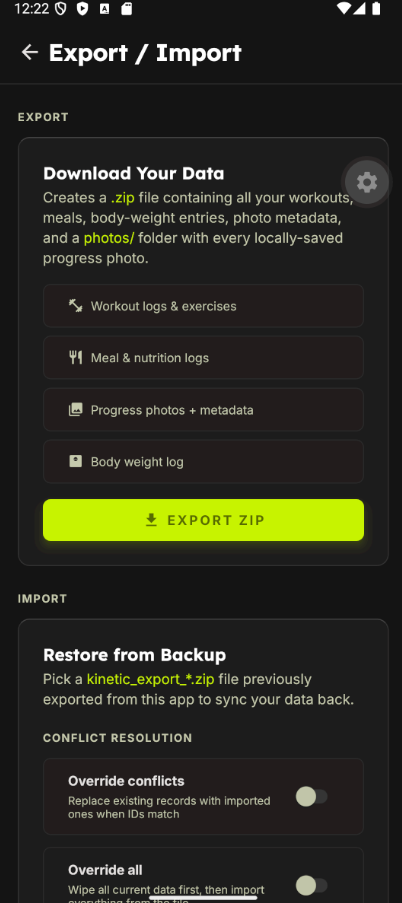
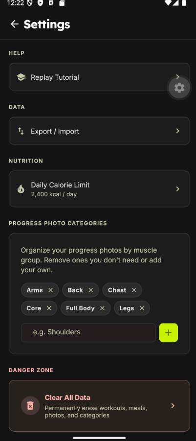

# Kinetic — Fitness Tracking App

Kinetic is a privacy-first, offline fitness tracking app built with React Native and Expo. All data lives on your device — no accounts, no cloud, no subscriptions.

---

## Functionalities

### Dashboard
Central home screen showing an at-a-glance summary of today's activity:
- **Calorie ring** — daily calorie intake vs. target, updates in real time as meals are logged
- **Macro summary** — protein, carbs, and fat breakdown for today
- **Recent weight** — latest body weight reading with a 7-day sparkline chart
- **Featured gallery photo** — the photo you marked as featured from your progress gallery
- **AI Coach Insights** — powered by Google Gemini: weekly trend summary and personalised advice based on your logged data

### Workouts
Log strength training sessions using pre-built templates or custom exercises:
- **Primary lift card** — highlights your most-trained lift with its latest working weight and trend chart
- **Workout logger** — pick a template or create your own, log sets/reps/weight per exercise
- **Session history** — scrollable list of past workouts with exercise details
- **Metrics grid** — total workout count, volume (kg), avg exercises/session, streak (weeks)

### Nutrition
Track daily food intake and macro goals:
- **Add meals** — name, meal type (Breakfast/Lunch/Dinner/Snack), calories, protein, carbs, fat, and an optional photo
- **Barcode scanner** — scan food packaging (camera-based) to pre-fill nutrition data via Gemini
- **AI food lookup** — type a food name and let Gemini fill in estimated macros
- **Calorie target** — configurable daily calorie goal with real-time progress ring
- **Daily history** — chronological meal log with photo thumbnails

### Progress Gallery
Document your physique progress with dated photos:
- **Add photos** — pick from your library or capture with the camera; photos are stored permanently in a private app folder
- **Categorise** — tag photos with body parts (Chest, Back, Arms, Legs…)
- **Feature a photo** — mark any photo to be highlighted on the Dashboard
- **Before/After compare** — side-by-side comparison with optional AI analysis (Gemini)
- **Picture-not-found handling** — if a photo is deleted externally via the file manager, the app shows a graceful placeholder instead of crashing
- **Custom categories** — add and remove your own photo categories in Settings

### Body Weight
Track your body weight over time:
- **Log weight** — tap to add today's reading in kg
- **History view** — full chronological list with delete support
- **Charts** — 7-day and 30-day sparkline charts available on Dashboard and Workouts screens

### Settings & Data Management
- **Calorie target** — set your daily kcal goal
- **Export data** — export everything as a `.zip` file: structured JSON + your local photos + gallery metadata. Share via any app (Files, email, cloud)
- **Import data** — pick a previously exported `.zip` to restore data; choose whether to merge or fully override existing records
- **Clear data** — selectively wipe workouts, meals, gallery, weight, or custom categories
- **Replay onboarding** — re-watch the feature walkthrough at any time

### Onboarding
A one-time swipeable tutorial on first launch that walks through every feature screen.

---

## Tech Stack

| Layer | Technology |
|-------|-----------|
| Framework | React Native 0.79 + Expo SDK 56 |
| Language | TypeScript 6 (strict mode) |
| Styling | NativeWind v4 (Tailwind CSS for React Native) |
| Navigation | React Navigation 7 (native stack + bottom tabs) |
| Database | expo-sqlite (SQLite, persistent on-device) |
| File storage | expo-file-system/legacy (photos stored in `documentDirectory`) |
| Fonts | Lexend + Inter via `@expo-google-fonts` |
| Icons | `@expo/vector-icons` (MaterialIcons) |
| AI | Google Gemini (gemini-2.0-flash via REST; food lookup, coach insights, progress compare) |
| Export/Import | JSZip (pure JS ZIP bundling; no native modules) |
| Camera | expo-camera + expo-image-picker |
| Barcode | expo-camera barcode scanning |
| Charts | Custom `SmoothLineChart` component (react-native-svg) |
| Testing | Jest 29 + jest-expo + @testing-library/react-native v14 |

---

## Project Structure

```
kinetic-app/
├── App.tsx                        # Root: font loading, providers, splash screen
├── src/
│   ├── context/                   # Global state (React Context)
│   │   ├── DataContext.tsx         # Reset token bus (clears data by category)
│   │   ├── WorkoutContext.tsx      # Workouts CRUD + derived stats
│   │   ├── NutritionContext.tsx    # Meals CRUD + macro totals
│   │   ├── BodyMetricsContext.tsx  # Weight entries + weekly/monthly series
│   │   ├── GalleryContext.tsx      # Gallery items + compare images
│   │   ├── CategoriesContext.tsx   # Custom photo categories
│   │   └── OnboardingContext.tsx   # First-run flag
│   │
│   ├── storage/                   # Persistence layer
│   │   ├── database.ts             # SQLite schema + all CRUD helpers (getDb singleton)
│   │   ├── photos.ts               # File-system helpers (save/copy/delete/read photos)
│   │   └── exportImport.ts         # ZIP export + ZIP import logic
│   │
│   ├── screens/                   # Full-page screen components
│   │   ├── DashboardScreen.tsx
│   │   ├── WorkoutsScreen.tsx
│   │   ├── WorkoutsStack.tsx       # Stack navigator for Workouts tab
│   │   ├── WorkoutHistoryScreen.tsx
│   │   ├── NutritionScreen.tsx
│   │   ├── NutritionStack.tsx
│   │   ├── NutritionHistoryScreen.tsx
│   │   ├── GalleryScreen.tsx       # Gallery tab root (hosts Overview + SideBySide)
│   │   ├── GalleryOverviewScreen.tsx
│   │   ├── ProgressAnalysisScreen.tsx
│   │   ├── WeightHistoryScreen.tsx
│   │   ├── SettingsScreen.tsx
│   │   └── ExportImportScreen.tsx
│   │
│   ├── components/                # Reusable UI components
│   │   ├── GlassCard.tsx           # Frosted-glass card container
│   │   ├── SmoothLineChart.tsx     # SVG sparkline chart
│   │   ├── ProgressRing.tsx        # Animated SVG ring
│   │   ├── InputModal.tsx          # Generic text-input bottom sheet
│   │   ├── LogMealModal.tsx        # Full meal-log form
│   │   ├── WorkoutLogModal.tsx     # Workout template picker + logger
│   │   ├── BarcodeScannerModal.tsx # Camera barcode scanner
│   │   ├── PhotoLightboxModal.tsx  # Full-screen photo viewer
│   │   ├── ClearDataModal.tsx      # Category-select clear-data dialog
│   │   ├── OnboardingTutorial.tsx  # Swipeable onboarding flow
│   │   ├── TopAppBar.tsx
│   │   ├── PrimaryButton.tsx
│   │   └── Labels.tsx              # H1/H2/H3/Body typography
│   │
│   ├── navigation/
│   │   ├── RootNavigator.tsx       # Combines bottom tabs + modal stacks
│   │   └── BottomNavBar.tsx        # Custom bottom tab bar
│   │
│   ├── data/
│   │   └── workoutTemplates.ts     # Built-in workout templates + exercise list
│   │
│   ├── utils/
│   │   ├── date.ts                 # Date formatting helpers
│   │   ├── imagePicker.ts          # expo-image-picker wrapper
│   │   ├── imageToBase64.ts        # Converts local URIs to base64
│   │   ├── foodLookup.ts           # Barcode → food data lookup (USDA/Open Food Facts)
│   │   ├── geminiClient.ts         # Gemini API base client
│   │   ├── geminiFood.ts           # Gemini food analysis
│   │   ├── geminiCoachInsights.ts  # Gemini weekly coach summary
│   │   ├── geminiTrendSummary.ts   # Gemini trend analysis
│   │   └── geminiProgressCompare.ts# Gemini before/after photo analysis
│   │
│   ├── theme/
│   │   └── colors.ts               # Design token palette (cyber-dark theme)
│   │
│   └── __tests__/                 # Jest unit tests (147 tests, 12 suites)
│       ├── utils.date.test.ts
│       ├── utils.imageToBase64.test.ts
│       ├── storage.database.test.ts
│       ├── storage.photos.test.ts
│       ├── storage.exportImport.test.ts
│       ├── context.data.test.tsx
│       ├── context.categories.test.tsx
│       ├── context.nutrition.test.tsx
│       ├── context.bodyMetrics.test.tsx
│       ├── context.gallery.test.tsx
│       ├── context.onboarding.test.tsx
│       └── context.workout.test.tsx
│
├── __mocks__/                     # Jest manual mocks
│   ├── expo-sqlite.js
│   ├── expo-file-system.js
│   ├── expo-file-system/legacy.js
│   ├── expo-sharing.js
│   ├── expo-document-picker.js
│   └── @expo/vector-icons.js
│
├── assets/                        # App icon, splash, and static images
├── App.tsx
├── app.json                       # Expo project config
├── babel.config.js
├── jest.config.js
├── jest.setup.js
├── tailwind.config.js
└── tsconfig.json
```

---

## How It Works

### Data flow

```
User action (screen/component)
        │
        ▼
  React Context (useWorkouts / useNutrition / useGallery / …)
        │  reads on mount, writes on every mutation
        ▼
  storage/database.ts  (SQLite via expo-sqlite)
        │  gallery items also write photos to disk via
        ▼
  storage/photos.ts  (expo-file-system — documentDirectory/kinetic-photos/)
```

Every context follows the same lifecycle:
1. **Mount** — `useEffect` calls `db.getAll*()` and populates local state
2. **Mutation** — each action (add/remove/update) writes to SQLite first, then updates React state so the UI re-renders immediately without re-querying
3. **Reset** — `DataContext` broadcasts a "reset token" increment; each context subscribes via `useClearOnReset` and wipes its state + calls `db.clear*()`

### SQLite schema

All tables use `TEXT PRIMARY KEY` UUIDs generated with `crypto.randomUUID()`:

| Table | Key columns |
|-------|------------|
| `workouts` | `id`, `name`, `exercises_json`, `logged_at` |
| `meals` | `id`, `name`, `meal`, `kcal`, `protein`, `carbs`, `fat`, `weight_grams`, `image`, `logged_at` |
| `weight_entries` | `id`, `kg`, `date` |
| `gallery_items` | `id`, `date_label`, `local_path`, `is_remote`, `featured`, `category`, `created_at` |
| `categories` | `name` (primary key) |
| `settings` | `key`, `value` (key-value store for config) |

### Photo storage

Photos added from the picker or camera are **copied** from the transient URI into `documentDirectory/kinetic-photos/<uuid>.jpg`. The database stores the permanent `file://` path. If the file is deleted externally, `isPhotoAccessible()` returns `false` and the gallery shows a "Picture not found" placeholder — the metadata row is preserved so the item remains in the timeline.

Seed/remote photos (`is_remote = 1`) are stored as HTTPS URLs and are never copied to disk.

### Export / Import

**Export** (`exportAllData`):
1. Queries all tables
2. Serialises workouts/meals/weights/settings/categories into `data.json`
3. Serialises gallery metadata into `gallery_meta.json`
4. Reads each local photo as base64 and bundles into `photos/<id>.jpg` inside the ZIP
5. Writes the ZIP to `cacheDirectory` and shares it via the OS share sheet

**Import** (`pickAndImportData`):
1. Opens the document picker to choose a `.zip` file
2. Reads and parses `data.json` and `gallery_meta.json`
3. Restores photo files from `photos/` into `documentDirectory/kinetic-photos/`
4. Inserts records using `INSERT OR REPLACE` (override) or `INSERT OR IGNORE` (merge)
5. Two option flags: `overrideConflicts` (replace matching IDs) and `overrideAll` (wipe before insert)

---

## Running the App

### Prerequisites

- Node.js 18+
- Expo CLI (`npm install -g expo-cli`)
- iOS Simulator (macOS) or Android Emulator, or a physical device with the Expo Go app

### Install & start

```bash
npm install
npx expo start
```

Press `i` for iOS Simulator, `a` for Android Emulator, or scan the QR code with Expo Go.

### Running tests

```bash
# Run all tests
npx jest

# Run with coverage report
npx jest --coverage

# Run a specific suite
npx jest storage.database
```

### TypeScript check

```bash
npx tsc --noEmit
```

---

## Screenshots

To add screenshots:

1. Run `npx expo start` and open the app on a simulator or device
2. Capture each screen and save to `assets/screenshots/`
3. Name them: `dashboard.png`, `workouts.png`, `workout-logger.png`, `nutrition.png`, `log-meal.png`, `gallery.png`, `compare.png`, `weight-history.png`, `export-import.png`, `settings.png`

The README will automatically display them once the files are in place:

```md










```

---

## Test Coverage

```
All files   | 94.9% stmts | 79.2% branch | 85.5% funcs | 96.4% lines
```

12 test suites · 147 tests · all passing

Thresholds enforced in `jest.config.js`: ≥85% statements, ≥85% functions, ≥85% lines, ≥70% branches.
